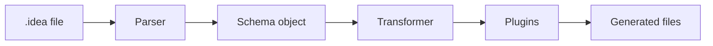

# Concepts Overview

Idea is a schema language plus a transformation runtime.

You write a `.idea` file, the parser turns it into a schema object, and
the transformer runs plugins that consume that schema.

## The Parts

### Parser

The parser reads `.idea` syntax and produces structured output.
It understands declarations such as `model`, `type`, `enum`, `prop`,
`plugin`, and `use`.

### Transformer

The transformer loads a schema file, resolves any `use` references,
caches the merged schema, and executes configured plugins.

### Plugins

Plugins are regular JavaScript or TypeScript modules. Each plugin
receives the loaded schema and its own config block.

### CLI

The CLI package wraps the transformer so you can run schema generation
from local scripts, builds, and CI.

### VS Code Extension

The extension adds syntax highlighting, diagnostics, completion,
formatting support, and navigation for `.idea` files.

## Where The Format Is Strict

The parser defines:

- the declaration forms
- supported literals
- arrays and objects
- comments
- how `use` and plugin blocks are structured

## Where The Format Is Flexible

Many attributes are metadata. For example, the parser can preserve an
attribute like `@field.text`, but the core format does not define what
that attribute must do. A plugin or downstream toolchain gives it
meaning.

That is the key design choice in Idea:

- the core language defines structure
- the ecosystem defines semantics

## Reader Paths

If you are evaluating the project:

- read the [root README](https://github.com/stackpress/idea/blob/main/README.md)
- follow the [Getting Started](https://github.com/stackpress/idea/blob/main/docs/getting-started.md)

If you are learning the format:

- read [The `.idea` File](https://github.com/stackpress/idea/blob/main/docs/concepts/the-idea-file.md)
- read [Schema Building](https://github.com/stackpress/idea/blob/main/docs/concepts/schema-building.md)

If you are building with it:

- read [Run a Schema](https://github.com/stackpress/idea/blob/main/docs/how-to/run-a-schema.md)
- read [Write a Plugin](https://github.com/stackpress/idea/blob/main/docs/how-to/write-a-plugin.md)
