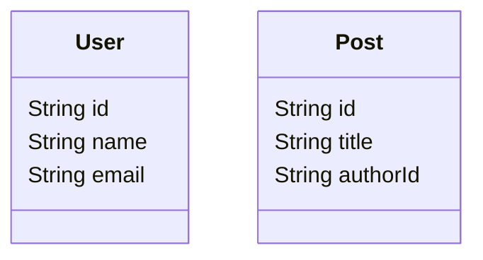

# Getting Started

This guide takes you from an empty folder to a generated file.

## What You Will Build

You will create:

- an `.idea` schema with two simple models
- a small plugin
- a generated schema diagram file

## Prerequisites

- Node.js 22 or newer
- npm or yarn

## 1. Install Idea

```bash
npm i -D @stackpress/idea
```

## 2. Create A Schema

Create `schema.idea`:

```ts
plugin "./schema-diagram.mjs" {
  output "./generated/schema.mmd"
}

model User {
  id String @id
  name String
  email String
}

model Post {
  id String @id
  title String
  authorId String
}
```

This file does two things:

- declares two simple models
- tells the transformer to run `./schema-diagram.mjs`

## 3. Create A Plugin

Create `schema-diagram.mjs`:

```js
import fs from 'node:fs/promises';
import path from 'node:path';

export default async function schemaDiagram({ config, schema, transformer }) {
  const output = await transformer.loader.absolute(config.output);
  const lines = ['classDiagram'];

  for (const [name, model] of Object.entries(schema.model || {})) {
    lines.push(`  class ${name} {`);

    for (const column of model.columns || []) {
      lines.push(`    ${column.type} ${column.name}`);
    }

    lines.push('  }');
    lines.push('');
  }

  await fs.mkdir(path.dirname(output), { recursive: true });
  await fs.writeFile(output, `${lines.join('\n').trim()}\n`, 'utf8');
}
```

This plugin receives:

- `config`: the object inside the `plugin` block
- `schema`: the parsed schema
- `transformer`: the running transformer instance

## 4. Run The CLI

```bash
npx idea transform --input schema.idea
```

If you omit `--input`, the CLI looks for `schema.idea` in the current
working directory.

## 5. Verify The Output

You should now have `generated/schema.mmd`:



At this point you have used the whole toolchain:

1. the parser read the `.idea` file
2. the transformer loaded the schema
3. the plugin generated a file

## What To Read Next

- [Concepts Overview](https://github.com/stackpress/idea/blob/main/specs/concepts/overview.md)
- [The `.idea` File](https://github.com/stackpress/idea/blob/main/specs/concepts/the-idea-file.md)
- [Write a Plugin](https://github.com/stackpress/idea/blob/main/specs/how-to/write-a-plugin.md)
- [CLI Reference](https://github.com/stackpress/idea/blob/main/specs/reference/cli.md)
